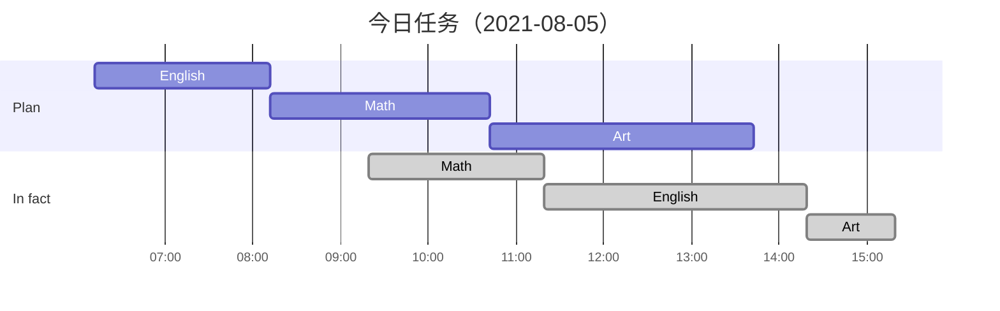

医者，讲究对症下药，何谓“**低效**”？

也许大家平时都会有这样一种感觉：明明主动花时间去投入时间学习或者工作，但最终的产出却少的可怜，一天恍恍惚惚过去了，却好像什么事情都没做成。顾名思义，低效主要表现在：原计划可能 1 天就能完成的事情却偏偏拖到第 3 天才完成。我们在晚上睡觉前不妨坦诚布公地问自己以下几个问题「**非常重要**」：

- **今天哪件事最重要？我完成它了吗？**
- **是什么导致手头的计划没有正常进行下去？**
- **如果重来一遍哪些地方能做的更好？**

这里，我以自己的亲身经历来举例分析：

- 今天，完成 Hilt 技术调研和实践很重要。我没有完成这项任务。
- 对于依赖注入、控制反转、Dagger 等概念和使用方式印象有点模糊，需要先复习一下相关知识点，从而导致前置学习时间超乎了预期。另外相关文档和学习资源汲取较多，没有完全吸收完毕，导致“实战训练”这一项任务没有完成。
- 应该在计划设定前就估算好可能面临的难点和障碍，适度容错时间。文档方面的参考较为杂乱，应该优先以官方文档为主，至少能对技术的组成和脉络有基本的了解，然后再结合1～2篇实战文章来加深理解。此外，针对技术的学习需要预留一定的源码分析时间，有助于对技术的底层实现形成大概的网状结构图，无需探索太深，适可而止。

低效的大部分原因都是主观意愿的问题。我们不能盲目地去制定太过长远和繁重的计划，否则每天骨鲠在喉，无法全身心投入，实属得不偿失。人不是机器，没办法同时去考虑和进行多项任务，只能一件件地完成，同时这也是能保证最佳效率产出的方式之一。

个人认为，保持专注和提高效率的最佳方式是**细化任务，微量而行**。漫无边际的目标太损耗人的身心，不知不觉便会陷入泥潭之中，同时，中间的过程无法合理把控，最终很可能就会不了了之。如果我们将一项目标划分为多个细小的任务，对我们自己来说完成其中一项是轻而易举的，在任务稳步推进的同时也会增加我们的自信力。如果我们每天把计划和结果合理统计和记录，那样就再好不过了。可以借助工具去帮助自己慢慢调整心态和规划任务图谱，像图表、甘特图之类具有一定统计效果的工具都不错。比如，我个人更加偏向下面这样甘特图方式：

这里我创建了“计划任务”和“实际完成情况”两栏用做对比，可以比较直观看出我计划投入各项任务的时间节点和比重，并与实际情况做对比，这样就能够简单统计出一天的任务完成情况。根据最终统计结果，我们可以适度分析并标注后续应该改善的地方，如此一来就能够持续纠正并往良性方向发展。

下面这个是稍微复杂的版本：

具体使用方法可以参考 mermaid 使用文档：

同时，他们支持网页在线编辑和一键导出图片格式文件，算是方便多了：

最终，送大家一首人尽皆知的诗：

> ***明日复明日，明日何其多。***
> ***我生在明日，万事成蹉跎。***

前进路上还需要时刻保持信心，始终以积极的心态去面对未来的各种挑战。我不怕万人阻挡，就怕自己投降！
