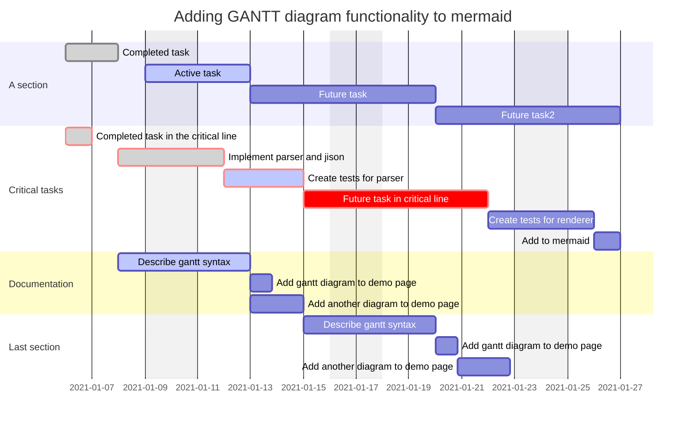

医者，讲究对症下药，所以，我们首先要分析一下何谓“**低效**”。

也许大家平时都会有这样一种感觉：明明主动花时间去投入时间学习或者工作，但最终的产出却少的可怜，一天恍恍惚惚过去了，却好像什么都没做成。

低效的大部分原因都是主观意愿的问题。

终极解决方式就是细化学习任务和时间投入。你可以从两个方面去采取措施。。。

借助工具去帮助自己慢慢调整心态和图谱规划。图表、甘特图等等，按任务/小时划分

